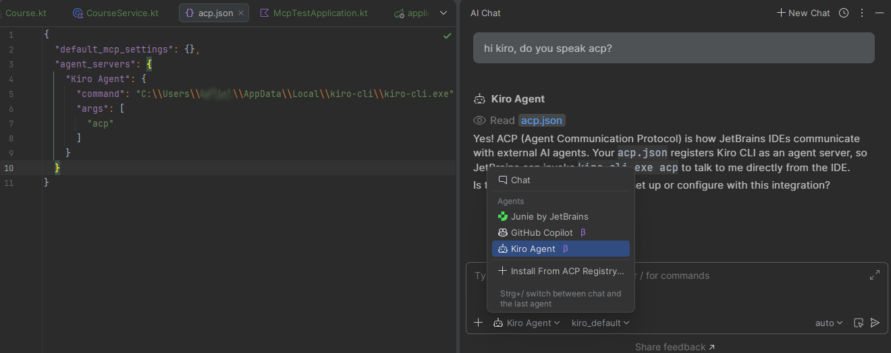

# Agent Client Protocol
[🔙README](/README.md)

ACP allows most AI development tools to be integrated into IDEs. This means you can integrate multiple AI development tools into a single window. However, there are limitations. Features that are exclusive to IDEs such as the Kiro IDE are not supported; only the CLI capabilities are available. Below is a screenshot of my IntelliJ where I have integrated Kiro and Copilot via ACP. Kiro([acp docs for the kiro cli](https://kiro.dev/docs/cli/acp/)) is set up as a custom agent in the acp.json file, and Copilot is integrated using a ready-made option from IntelliJ (I couldn’t find an official solution for Antigravity’s CLI, agy; Junie, from JetBrains, was not integrated despite being displayed).

